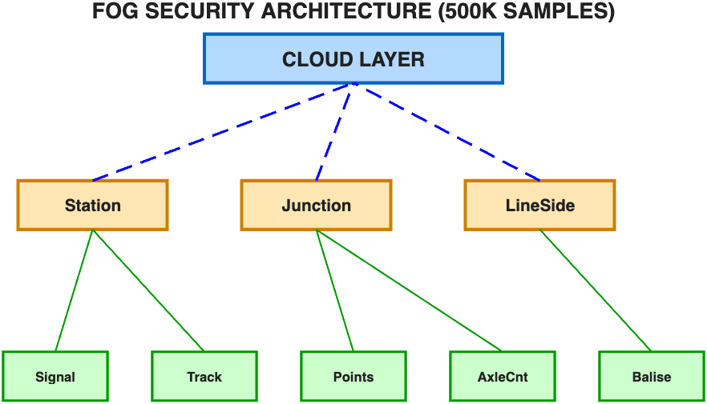
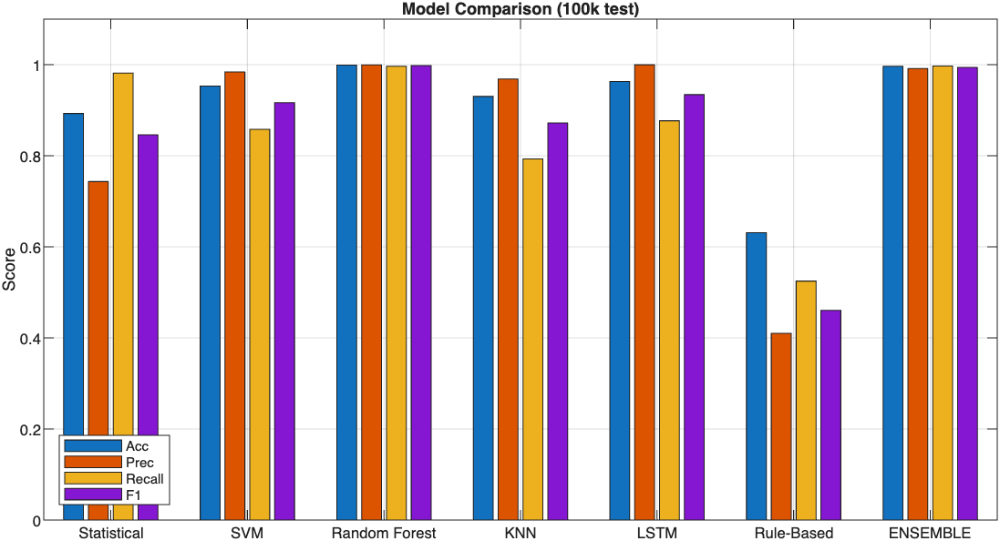

# RailGuard

[](https://www.mathworks.com/products/matlab.html)
[](https://github.com/rahulyadav3812/RailGuard/releases)
[](LICENSE)
[](docs/project-report.md)
[](docs/project-report.md)

MATLAB fog-computing intrusion detection project for railway signaling security.

## Overview

RailGuard is a MATLAB-based fog computing project that detects cyber attacks in railway signaling and control networks using a 3-tier Edge-Fog-Cloud architecture. The system is designed to move security analysis closer to operational devices so that threat detection happens at the fog layer with lower latency than cloud-only processing.

The project combines statistical anomaly detection, classical machine learning, deep learning, and rule-based safety checks to identify malicious data manipulation in safety-critical railway environments.

For a cleaner narrative summary of the academic report, see `docs/project-report.md`.

## Why this project matters

- Demonstrates practical use of fog computing for cyber defense
- Applies MATLAB to a real-world industrial control and railway security use case
- Compares 7 detection approaches on a structured multi-attack dataset
- Shows strong reported performance with low-latency fog-layer inference
- Connects machine learning, distributed systems, and critical-infrastructure security

## Skills demonstrated

This project highlights skills that are useful to recruiters evaluating cloud, cybersecurity, AI, and systems work:

- MATLAB system design and technical prototyping
- Fog and edge computing architecture
- Cybersecurity analytics for critical infrastructure
- Machine learning model comparison and evaluation
- Deep learning with LSTM-based sequence modeling
- Feature engineering and attack-dataset preparation
- Performance benchmarking and latency analysis
- Visualization and experiment reporting
- Defense-in-depth design using statistical, ML, DL, and rule-based methods
- Technical documentation and reproducible project organization

## Quick facts

| Metric | Value |
|---|---|
| Platform | MATLAB Online / MATLAB |
| Architecture | Edge -> Fog -> Cloud |
| Total samples | 15,000 |
| Engineered features | 20 |
| Attack classes | 6 |
| Detection approaches | 7 |
| Best single model | Random Forest |
| Best reported ensemble accuracy | 99.1% |
| Reported fog speedup vs cloud | 25.2x |

## Architecture

The design distributes monitoring and detection across three layers.

- Edge layer
  - Signal Controller (S1)
  - Track Circuit Monitor (TC1)
  - Points Machine (P1)
  - Axle Counter (AC1)
  - Eurobalise (B1)
- Fog layer
  - Station Fog Node
  - Junction Fog Node
  - Lineside Fog Node
- Cloud layer
  - Centralized monitoring
  - Alert aggregation
  - Long-term storage
  - Model retraining

Security features referenced in the report:
- AES-256 encryption
- RSA-2048 key exchange
- real-time fog-layer inference



## Threat model

RailGuard targets multiple attack classes that can affect signaling integrity and operational decision-making:

- False Data Injection (FDI)
- Replay Attack
- Man-in-the-Middle (MITM)
- Denial of Service (DoS)
- Signal Spoofing
- Command Manipulation

## Dataset summary

The included report describes the following dataset profile:

| Metric | Value |
|---|---|
| Total samples | 15,000 |
| Normal samples | 10,000 |
| Attack samples | 5,000 |
| Train/test split | 80/20 |
| Engineered features | 20 |

Feature groups include:
- signal state, speed, and track occupancy
- deviation and consistency metrics
- network latency and packet attributes
- hash and integrity validation checks
- safety-rule consistency features

## Detection models

RailGuard includes seven detection approaches:

1. Statistical Anomaly Detector
2. Support Vector Machine (SVM)
3. Random Forest
4. K-Nearest Neighbors (KNN)
5. LSTM Neural Network
6. Rule-Based IDS
7. Weighted Ensemble Model

## Reported results

The following results are summarized from the included project report files:

| Model | Accuracy | Precision | Recall | F1-Score |
|---|---:|---:|---:|---:|
| Statistical | 0.8060 | 0.6359 | 0.9780 | 0.7707 |
| SVM | 0.9380 | 0.9744 | 0.8360 | 0.8999 |
| Random Forest | 0.9990 | 1.0000 | 0.9970 | 0.9985 |
| KNN | 0.8980 | 0.8998 | 0.7810 | 0.8362 |
| LSTM | 0.9710 | 0.9989 | 0.9140 | 0.9546 |
| Rule-Based | 0.5703 | 0.4022 | 0.5940 | 0.4796 |
| Ensemble | 0.9907 | 0.9755 | 0.9970 | 0.9862 |

Key takeaways:
- Best single model: Random Forest
- Ensemble accuracy: 99.1%
- Ensemble recall: 99.7%
- Reported fog-layer latency: 4.14 ms for 1000 samples
- Reported cloud-layer latency: 104.14 ms for 1000 samples
- Real-time target under 500 ms: achieved



## Repository structure

```text
RailGuard/
├── README.md
├── LICENSE
├── docs/
│   └── project-report.md
├── 10_Rahul.pdf
├── setup.m
├── main.m
├── run_pipeline.m
├── run_security_models.m
├── run_tuning_and_visualization.m
├── run_phase7_only.m
├── src/
│   ├── data_generation/
│   ├── fog_architecture/
│   ├── preprocessing/
│   ├── security_models/
│   ├── utils/
│   └── visualization/
├── tests/
├── data/
├── models/
└── results/
    ├── figures/
    ├── logs/
    └── tables/
```

## Important files

| File | Purpose |
|---|---|
| `main.m` | Main execution pipeline |
| `setup.m` | Project setup and path initialization |
| `run_pipeline.m` | End-to-end data and workflow execution |
| `run_security_models.m` | Model training and evaluation |
| `run_tuning_and_visualization.m` | Visualization and tuning workflow |
| `run_phase7_only.m` | Focused execution for a later project stage |
| `docs/project-report.md` | Clean markdown version of the report |
| `results/FULL_PROJECT_REPORT.txt` | Full extracted report text |
| `results/PROJECT_SUMMARY.txt` | Concise report summary |
| `results/tables/model_comparison.csv` | Model comparison results |

## Getting started

### Requirements

- MATLAB
- Statistics and Machine Learning Toolbox
- Deep Learning Toolbox

### Typical workflow

1. Open the project folder in MATLAB.
2. Run `setup.m`.
3. Run `main.m`.

### Alternative execution entry points

- `run_pipeline.m`
- `run_security_models.m`
- `run_tuning_and_visualization.m`
- `run_phase7_only.m`

## Releases and versioning

This repository follows simple semantic versioning for milestone snapshots.

| Version | Status | Notes |
|---|---|---|
| `v1.0.0` | Initial public release | MATLAB fog-computing railway cybersecurity project, README polish, license, and report documentation |

Release guidance:
- `v1.x` for documentation, reproducibility, and workflow improvements
- `v2.x` for major architecture or model changes
- GitHub Releases can be used to publish milestone snapshots of code, documentation, and results

See the Releases page:
https://github.com/rahulyadav3812/RailGuard/releases

## Future work

Potential next steps for extending RailGuard:

- validate the pipeline on larger or real industrial telemetry datasets
- add streaming or online inference instead of batch evaluation only
- evaluate explainability methods for operational decision support
- integrate additional deep-learning and anomaly-detection models
- simulate more railway-specific fault and attack scenarios
- package the workflow into a cleaner reusable MATLAB project template
- connect fog-node alerts to a live dashboard or SIEM-style workflow

## Standards and references

The report references alignment with:
- ERTMS/ETCS SUBSET-026
- EN 50129
- IEC 62443

## Project report sources

This README is based on the project materials included in the repository, especially:
- `10_Rahul.pdf`
- `results/FULL_PROJECT_REPORT.txt`
- `results/PROJECT_SUMMARY.txt`

## Author

Rahul Yadav

## License

This project is released under the MIT License. See `LICENSE` for details.
